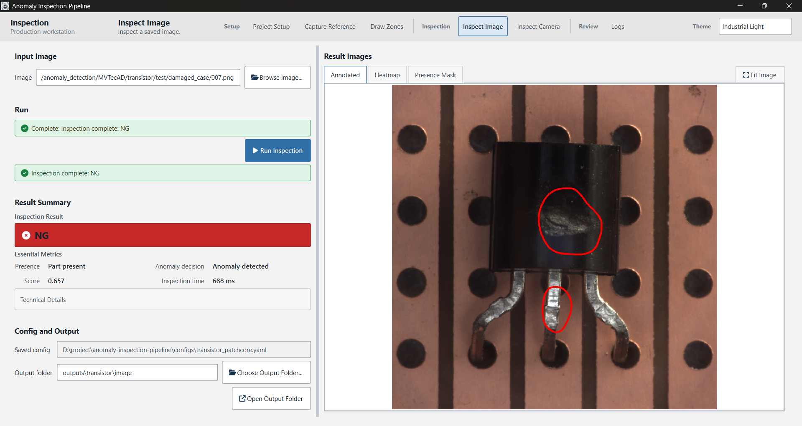

# anomaly-inspection-desktop-app

anomaly-inspection-desktop-app is a PySide6 desktop application for local anomaly inspection workflows.

The app uses a presence-gated pipeline: it first checks whether a part is present using a reference image and inspection zones, then runs anomaly inference only when a part is detected. The desktop workflow includes project setup, runtime preparation, image inspection, camera inspection, result visualization, and log/artifact review.

It is designed for practical fixed-camera inspection experiments where generated assets, local configs, datasets, model files, and outputs stay outside the public repository.

---

## Package Layout

The desktop application is the primary product. The command-line interface is a secondary adapter for automation and debugging; both call the same core inspection logic.

```text
src/anomaly_inspection/
  core/          inspection rules, pipeline, model adapters, and result contracts
  desktop/       PySide6 application, workflow pages, and reusable UI components
  cli.py         command-line entry point
  cli_support/   OpenCV helpers used only by CLI setup commands
```

Tests follow the same boundaries under `tests/core`, `tests/desktop`, `tests/cli`, and `tests/tools`.

---

## Demo

YouTube Demo: [Watch the demo](https://www.youtube.com/watch?v=actU9yC096Y)

---

## System Preview



---

## Dataset Credit

Sample inspection images used in this demo are from the MVTec Anomaly Detection Dataset, Transistor category.  
The dataset belongs to the original MVTec AD authors/owners and is used here only for demonstration and educational/portfolio purposes.

---

The system combines:

```text
input image
  -> polygon-zone presence verification
  -> if NO_PART: skip anomaly model
  -> if PART_PRESENT: Anomalib-compatible anomaly inference
  -> final result: NO_PART / OK / NG / ERROR
```

The presence gate is independent of the anomaly model family. It protects against cases where an anomaly model does not represent an empty station correctly.

## Supported Model Artifacts

The anomaly inference layer supports:

- Anomalib-compatible Lightning `.ckpt` checkpoints.
- Anomalib-compatible exported Torch `.pt` artifacts.
- Anomalib-compatible exported OpenVINO `.xml` artifacts with adjacent `.bin` weights.

Verified examples:

- PatchCore Lightning `.ckpt`
- Reverse Distillation / RD exported Torch `.pt`
- PatchCore OpenVINO `.xml/.bin`

The `.pt` support uses a general exported-Torch backend through Anomalib `TorchInferencer`; it is not RD-specific. A compatible PatchCore exported `.pt` should use the same backend path, subject to the actual artifact being produced by a supported Anomalib export workflow.

The OpenVINO backend uses direct OpenVINO Runtime inference. It keeps presence checking and saved visualizations at the original source-image resolution, then resizes internally to the OpenVINO model input size before inference.

## Decision Rule

When the model exposes `pred_label`, the project uses it as the primary OK/NG decision:

```text
pred_label=True  -> NG
pred_label=False -> OK
```

`pred_score` is preserved in CSVs and terminal output for analysis and threshold validation. For Anomalib models, runtime `pred_score` may be post-processed/normalized, while checkpoint thresholds may be raw model-score thresholds, so they should not be mixed without verifying score scale.

## Presence Verification

Presence verification compares the current image against an empty-station reference image inside one or more polygon zones. A part is present only when both conditions pass:

```text
foreground_ratio >= min_foreground_ratio
largest_blob_area >= min_blob_area
```

This deterministic gate is useful for fixed-camera, stable-background stations where the part visually differs from the background.

## Setup

Install the package in editable mode for local development:

```bash
python -m pip install -e .
```

The base install includes the core inspection pipeline dependencies. Add extras for the desktop UI, anomaly-model runtime, and tests as needed:

```bash
python -m pip install -e ".[gui]"
python -m pip install -e ".[gui,anomaly,test]"
```

Run tests with:

```bash
python -m pytest
```

After editable install, command-line entry points are available:

```bash
anomaly-inspection
anomaly-inspection-cli --help
```

The former command names remain available as compatibility aliases:

```bash
inspection-app
inspection-cli --help
```

GUI assets are shipped as package data, so editable and wheel installs use the same asset paths. Public configuration templates remain under `configs/` for local setup.

## Desktop App

The PySide6 desktop frontend is the primary app experience, with the existing CLI workflow still available for setup, automation, and debugging. The current desktop app opens a main window with compact top navigation, current page title/subtitle in the left side of the shell, product branding on the right, no global bottom status bar, shared app state, a functional Project Setup page for YAML config management, a functional Capture Reference page for webcam reference-image capture, a functional Draw Zones page for polygon zone setup, functional Inspect Image and Inspect Camera pages, and a functional Logs page for CSV history review.

Launch it after installing the `gui` extra:

```bash
anomaly-inspection
```

The Project Setup page can:

```text
open an existing YAML config
edit model, presence, and output fields
browse for model, reference image, and zones JSON paths
validate config values with the backend config rules
confirm the model file, reference image, and zones JSON exist
save or save-as a local YAML config
```

`Validate Config` does not load or run the anomaly model. It checks config structure/value compatibility and required local file existence only.

The Capture Reference page can:

```text
choose the output reference image path
select camera index
optionally request camera width and height
preview the webcam feed
capture an empty background frame
retake or save the captured frame
```

Saved reference images use the original captured camera frame resolution, not the preview-scaled UI image. If the saved path differs from the Project Setup reference path, the app updates the in-memory Project Setup field but does not auto-save the YAML config.

The Draw Zones page can:

```text
select and load a reference image
choose the zones JSON save path
click the image to add polygon points
finish polygons
start a new polygon
clear the current unfinished polygon or all zones
save zones JSON
```

Draw Zones starts a fresh drawing session when a reference image is loaded. It does not automatically preload polygons from an existing zones JSON. Saving overwrites the selected zones JSON with current-session polygons, using the backend-compatible schema and original source-image coordinates. Zone labels use Arabic numerals such as `Zone 1` and `Zone 2`, and canvas overlay styling scales with the loaded reference image resolution for more consistent editor readability. Capture Reference and Draw Zones use compact controls so the camera preview or drawing canvas remains the primary workspace.

The Inspect Image page can:

```text
select an inspection image
choose an output folder
run inspection using the saved YAML config selected in Project Setup
view the final result and key metrics
view annotated image, heatmap, and presence mask outputs inside the app
```

Inspect Image uses the saved config file path from Project Setup. It does not inspect from unsaved form edits and does not auto-save YAML. During GUI inspection, CLI/OpenCV `show_images` windows are suppressed in memory; result artifacts are displayed natively in the Qt page. The page uses a stable control-left / artifact-right workspace so users can choose an image, run inspection, review artifacts, and choose the next image without the page reordering itself. Result image viewers use one integrated tab/action strip for Annotated, Heatmap, Presence Mask, and Fit Image.

The Inspect Camera page can:

```text
start a webcam preview
capture a part frame
retake or inspect the captured frame
run inspection using the saved YAML config selected in Project Setup
view the final result and key metrics
view annotated image, heatmap, and presence mask outputs inside the app
```

Captured source frames are saved under the selected output folder before inspection, using the original camera frame data rather than the preview-scaled UI image. During GUI camera inspection, CLI/OpenCV `show_images` windows are suppressed in memory; result artifacts are displayed natively in the Qt page. The camera page uses compact controls on the left and one large visual workspace on the right that switches between live preview, captured frame, and result artifact tabs.

The Logs page can:

```text
open inspection CSV logs generated by the project
find inspection_log.csv and summary.csv files under an output folder
load combined Job History from outputs/<job_slug>
review inspection records in a table
filter by final result, mode, and search image names or paths
show selected-record details
preview available annotated, heatmap, and presence-mask artifacts
open related files or folders when they exist locally
```

Job History combines camera `inspection_log.csv`, image `inspection_log.csv`, and folder `run_*/summary.csv` records found under the selected job root. The Mode column distinguishes Camera, Image, and Folder rows. New CSV rows include explicit `inspection_job`, `inspection_job_slug`, and `inspection_mode` metadata; the Logs page prefers those fields and falls back to path inference for older CSV files. Logs use a compact review-console workflow: load history, filter records, select a row, then review the result summary and artifact evidence in the same workspace. Secondary technical fields live under More Details so they do not crowd out artifact review. Logs are CSV-file based and loaded read-only in memory; the desktop app does not create a database, write merged CSV files, or modify inspection history files from this page. The CLI/OpenCV workflow remains available separately. PySide6 is included in the project dependency workflow for this frontend.

Recommended desktop workflow:

```text
1. Project Setup
2. Prepare Runtime: Capture Reference, Draw Zones, Validate Config, and test presence
3. Inspect Image
4. Inspect Camera
5. Logs / History
```

## Configuration

The repository tracks one public inspection config template and one zone JSON example. Copy the sample config to a local `.yaml` file, edit the paths for your machine, and keep the local file uncommitted.

```text
configs/inspection.sample.yaml
configs/zones.sample.json
```

Example local setup:

```powershell
Copy-Item configs\inspection.sample.yaml configs\local_inspection.yaml
```

Then edit `configs/local_inspection.yaml` with your model path, reference image path, and generated zone path. For real inspection, generate your own zone file with `setup-zones`; `configs/zones.sample.json` is only a schema example.

Model config supports both new and legacy keys:

```yaml
project:
  name: "default_job"

model:
  path: "path/to/model.ckpt"
  format: "ckpt"        # auto, ckpt, torch_export, openvino
  anomalib_model: "reverse_distillation"
  anomaly_threshold: 0.5
  device: "auto"
```

In the desktop app, `project.name` is shown as `Inspection Job`. It is used to derive job-centered default output folders. For example, `Transistor` defaults to `outputs/transistor/image` for Inspect Image, `outputs/transistor/camera` for Inspect Camera, and `outputs/transistor` for Logs. Users can still manually choose different output folders on each page.

The desktop setup workflow also proposes job-centered local setup assets by default: `data/jobs/<job_slug>/reference/empty_reference.png` for the empty reference image and `data/jobs/<job_slug>/zones/zones.json` for the presence zones. These are desktop conveniences only; the saved YAML config still stores explicit `presence.reference_image_path` and `presence.zones_path` values, and existing configs that use paths such as `data/reference/empty_reference.png` or `configs/zones.json` remain valid.

Legacy `model.checkpoint_path` is still accepted as an alias for `model.path`.

Runtime policy is artifact-specific. Lightning checkpoint artifacts (`.ckpt`) use Anomalib `Engine.predict()`. Exported Torch artifacts (`.pt`) use the exported Torch inference path, and OpenVINO artifacts (`.xml`) use the OpenVINO backend. For deployment, exported `.pt` or OpenVINO `.xml` artifacts remain preferred because `.ckpt` inference is heavier and more dependent on the Anomalib/Lightning runtime. Re-check `anomaly_threshold` when changing artifact type or inference path because score scales can differ.

`pred_label` is the primary OK/NG decision source when the model provides it. `anomaly_threshold` is only a fallback comparison threshold when `pred_label` is unavailable. The configured threshold must match the score scale used by that fallback path; for the current normalized runtime score fallback, `0.5` is the correct example value.

The validation command uses the model section of the config. The presence fields are still required by the shared config schema, but the validation command does not run the presence gate.

Presence config:

```yaml
presence:
  reference_image_path: "data/reference/empty_reference.png"
  zones_path: "configs/zones.json"
  pixel_diff_threshold: 30
  min_foreground_ratio: 0.08
  min_blob_area: 500
  blur_kernel_size: 5
  morphology_kernel_size: 5
  use_largest_blob_filter: true
```

Output config:

```yaml
output:
  save_annotated: true
  save_heatmap: true
  save_presence_mask: true
  organize_by_result: true
  show_images: true
  save_csv_log: true
```

Real local artifacts are intentionally ignored: local configs, generated zone JSON, reference images, inspection images/datasets, model files, outputs, validation reports, heatmaps, overlays, and debug masks.

## Zone Setup

Capture an empty reference image from a webcam:

```bash
anomaly-inspection-cli capture-reference --output data/reference/empty_reference.png --camera-index 0
```

Optional camera resolution request:

```bash
anomaly-inspection-cli capture-reference --output data/reference/empty_reference.png --camera-index 0 --width 1280 --height 720
```

The webcam UI keeps the full camera frame visible and appends a bottom toolbar below it. The window is resizable; the preview is display-scaled to fit the current window while preserving the original frame aspect ratio. In live preview, use `Capture Background` to freeze the current frame or `Quit` to exit without saving. In captured preview, use `Use as Reference` to save the frozen frame, `Retake` to return to live preview, or `Quit` to exit without saving. The saved reference image is the original captured frame, not the resized preview; its resolution must match the later zone JSON and inspection images.

Draw polygon zones on the reference image:

```bash
anomaly-inspection-cli setup-zones --image data/reference/empty_reference.png --zones configs/zones.json
```

Use your copied local config with `presence.zones_path` set to the generated file, for example `configs/zones.json`.

The polygon editor also keeps the full source image visible and appends a bottom toolbar below it. The window is resizable; the editor display-scales the full image to fit the current window without cropping. Polygon clicks are mapped back to the original image coordinate system before saving. Click inside the image to add polygon points, then use the toolbar to finish and save.

Toolbar buttons:

```text
Undo Point       remove the last point from the current unfinished polygon
Finish Polygon   finalize the current polygon if it has at least 3 points
New Polygon      prepare for another polygon; finish the current one first if it has points
Clear Current    clear only the unfinished polygon points
Save Zones       save finalized polygons, overwriting the target JSON
Quit             exit the editor
```

When `Save Zones` is clicked, a valid unfinished polygon is finalized automatically. An unfinished polygon with fewer than 3 points is not saved. If there is no valid polygon, the editor does not overwrite the target JSON. Saving zones overwrites the target JSON with only the polygons created in the current session; existing zone files are not preloaded, appended, or merged. `Q` / `Esc` remain optional quit shortcuts.

The reference image, inspection images, and `zones.json` dimensions must match exactly. The project intentionally does not resize inspection images silently.

Interactive setup windows initially prefer native source size plus toolbar height, but the composed display is capped to a practical `1920x1080` target. Very large inputs may open display-scaled, but saved reference images and saved polygon coordinates remain based on original input data.

Recommended setup order before first inspection:

```text
1. Capture or prepare empty reference image
2. Draw polygon zones using that reference image
3. Validate config
4. Test presence
5. Run inspection
```

## Inspection CLI

Validate config, zones, and reference image:

```bash
anomaly-inspection-cli validate-config --config configs/local_inspection.yaml
```

`validate-config` reads the configured empty reference image and zone JSON, so create the reference image and zones before using it for the inspection workflow.

Run only the presence checker:

```bash
anomaly-inspection-cli test-presence --image data/samples/test_001.png --config configs/local_inspection.yaml --output outputs/presence_debug
```

Inspect one image:

```bash
anomaly-inspection-cli inspect-image --image data/samples/test_001.png --config configs/local_inspection.yaml --output outputs/single_test
```

Inspect a folder:

```bash
anomaly-inspection-cli inspect-folder --input data/samples/batch --config configs/local_inspection.yaml --output outputs/transistor/folder
```

If `output.show_images` is `true`, `inspect-image` displays saved annotated, heatmap, and presence-mask outputs after inspection and waits for a key press before closing the windows. For `inspect-folder`, it does the same for each image before proceeding to the next one. Set `show_images: false` for unattended or headless runs. Annotated outputs preserve the source image and, for NG results with usable anomaly heatmap evidence, add red defect contours only; metrics and status text remain in CSVs, terminal output, and the desktop UI.

If `output.save_csv_log` is `true`, single-image inspections append one row to `inspection_log.csv` in the output directory, preserving history across repeated Inspect Image or Inspect Camera runs that use the same folder. Single-image artifacts include the run ID in their filenames, so historical CSV rows keep pointing to the preserved annotated image, heatmap, and presence mask for that inspection. Camera source captures remain saved separately with timestamped filenames. `inspect-folder --output` treats the output path as a base folder and writes each batch run into a unique `run_<run_id>/` subfolder containing that run's `summary.csv`. Inspection logs include run ID, timestamp, explicit job/mode metadata, final result, presence metrics, anomaly outputs, saved artifact paths, timing fields, and errors. Model-validation CSV files are separate and are not controlled by this option.

## Model Validation CLI

Validate an anomaly model on arbitrary normal/abnormal folder mappings:

```bash
anomaly-inspection-cli validate-anomaly-model \
  --test-root "path/to/brainMRI/test" \
  --normal-folders good \
  --abnormal-folders bad \
  --config configs/local_inspection.yaml \
  --output outputs/model_validation/brainMRI_rd_pt
```

Splicing connector example:

```bash
anomaly-inspection-cli validate-anomaly-model \
  --test-root "path/to/splicing_connectors/test" \
  --normal-folders good \
  --abnormal-folders logical_anomalies structural_anomalies \
  --config configs/local_inspection.yaml \
  --output outputs/model_validation/splicing_connectors
```

Validation outputs:

```text
predictions.csv
threshold_sweep.csv
false_negatives.csv
false_positives.csv
summary.txt
```

## Image Model Compatibility Tools

The repository includes two local tools for checking Anomalib image-model artifacts against the app runtime. These tools do not train models, export models, download datasets, or discover artifacts automatically. They validate only local artifacts and local test images that you provide.

Single artifact validation:

```bash
python tools/validate_anomalib_artifact.py \
  --model-name patchcore \
  --artifact-path path/to/model.xml \
  --format openvino \
  --image-path path/to/test_image.png \
  --device cpu \
  --output-json outputs/compatibility/single_artifact.json
```

Matrix validation from a manifest:

```bash
python tools/run_compatibility_matrix.py \
  --manifest configs/compatibility_matrix.local.yaml \
  --output-json outputs/compatibility/matrix.json \
  --output-csv outputs/compatibility/matrix.csv
```

Start from the placeholder-only example:

```text
configs/compatibility_matrix_example.yaml
```

Copy it to a local manifest such as `configs/compatibility_matrix.local.yaml`, then replace the placeholder paths with local model artifacts and test images. Local compatibility manifests remain ignored by Git; do not commit absolute local paths, datasets, model artifacts, or generated reports.

The compatibility tools are image-only. They target single-image anomaly inspection artifacts:

```text
ckpt         -> Anomalib Engine checkpoint inference
torch_export -> exported Torch inference
openvino     -> OpenVINO inference
```

Video models such as `ai_vad` and `fuvas` are out of scope for this desktop image inspection runtime. Image-special models such as prompt-based, few-shot, API-backed, or foundation-model workflows may be listed in a manifest, but they should be marked with `support_level` or `notes` when they need extra runtime design.

Status meanings:

```text
verified_pass                  artifact loaded and predicted successfully for one image
verified_fail                  artifact or prediction failed for the supplied row
no_local_artifact              artifact was not available locally; this is unverified, not unsupported
needs_special_handling         model/runtime needs extra design beyond normal single-image inspection
unsupported_not_image_runtime  video or non-image runtime; not a target for this project
unsupported_special_runtime    special runtime requirement blocks validation
unknown_needs_investigation    status could not be classified yet
```

`verified_pass` is narrow evidence: one artifact and one image passed through the selected backend. It is not a blanket support claim for an entire Anomalib model family. Claim production support only after enough representative artifacts and images pass for the intended deployment conditions.

## Inspection Outputs

```text
outputs/transistor/folder/
  run_20260515_173012_123456/
    summary.csv
    annotated/
    heatmaps/
    presence_masks/
    OK/
    NG/
    NO_PART/
    ERROR/
```

`summary.csv` includes run metadata, image path/name, final result, presence metrics, anomaly score, `pred_label`, backend name, fallback threshold, saved artifact paths, timing fields, and error messages. Folder-run artifact names include safe relative-path context, so nested files with the same stem, such as `ok/001.png` and `ng/001.png`, do not overwrite each other inside one run.

## Limitations

- The presence gate can fail with lighting shifts, camera motion, shadows, background changes, or low part/background contrast.
- `.ckpt` loading is currently verified with PatchCore Lightning checkpoints.
- `.pt` loading requires a compatible Anomalib exported Torch artifact.
- OpenVINO loading requires a compatible exported `.xml` file and adjacent `.bin` weights file.
- Some Anomalib exported Torch artifacts use pickle-based loading internally; only load trusted local artifacts.
- Threshold retuning should be based on representative OK/NG validation images.

## Future Improvements

- Add a REVIEW state.
- Add calibration helpers for presence and anomaly thresholds.
- Add brightness compensation for presence verification.
- Add optional detector/geometry checks for relational defects.
